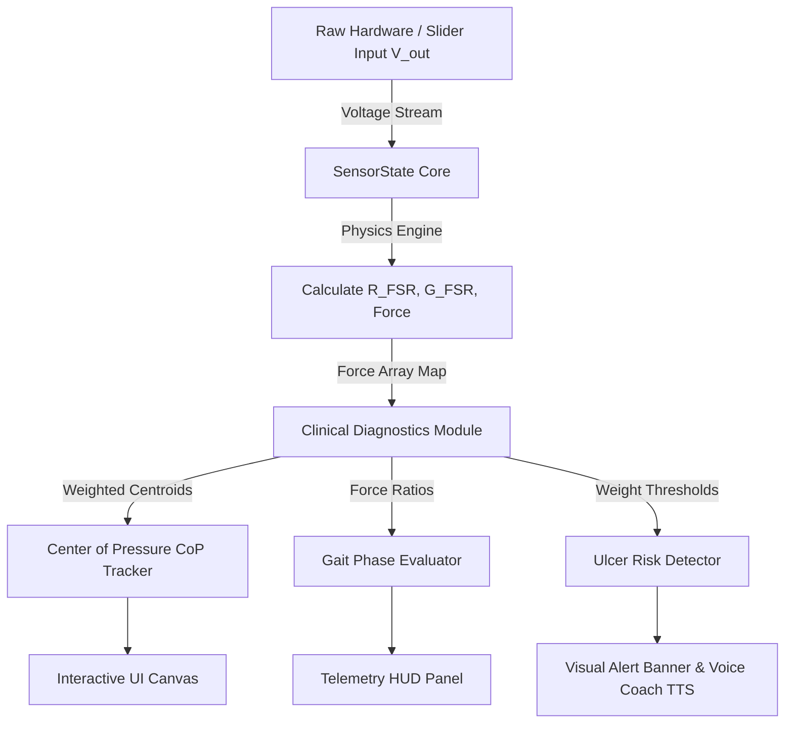

# SensiFoot 🩺⚙️

[](https://www.python.org/)
[](https://pypi.org/project/PyQt5/)
[](LICENSE)
[](https://github.com/psf/black)

**SensiFoot** is a high-fidelity biomedical diagnostic interface and hardware simulator engineered to process mathematically accurate Force Sensing Resistor (FSR) telemetry. Designed for prosthetists, podiatrists, and biomedical engineers, SensiFoot simulates complex plantar pressure arrays to evaluate real-time biomechanical diagnostics prior to physical hardware deployment.

The application evaluates critical clinical metrics including **Center of Pressure (CoP) tracking**, **dynamic Gait Phase classification**, and **Localized Ulcer Risk alerts**, wrapped in a commercial-grade "Clinical Dark Mode" UI.

---

## 🌟 Key Features

### 🦶 1. Interactive Anatomical Mesh (6-Sensor Array)
* **Anatomical Mapping**: Polygon tessellations mapped to six key anatomical load zones:
  - **Zone 0**: Heel
  - **Zone 1**: Midfoot Lateral
  - **Zone 2**: Metatarsal I (Medial)
  - **Zone 3**: Metatarsal III (Central)
  - **Zone 4**: Metatarsal V (Lateral)
  - **Zone 5**: Hallux (Big Toe)
* **Tiered Z-Index Layering**: Strict rendering hierarchy for crisp selection and node isolation without visual clipping.

### ⚡ 2. Real-Time Telemetry & Hardware Simulation
* **FSR Signal Pipeline**: Simulates analog hardware voltage input ($0.00\,\text{V} \rightarrow 3.30\,\text{V}$).
* **Dynamic SI Scaling**: Automatically formats engineering unit prefixes ($\text{k}\Omega$, $\text{M}\Omega$, $\mu\text{S}$, $\text{N}$, $\text{kN}$) with 2-decimal precision across the telemetry HUD.

### 🩺 3. Clinical Diagnostics & Gait Analytics
* **Biomechanical Gait Phase HUD**: Dynamically evaluates planar force distributions to output instant gait phases:
  - `SWING PHASE` ($F_{\text{total}} < 10\,\text{N}$)
  - `HEEL STRIKE` ($F_{\text{heel}} > F_{\text{forefoot}}$)
  - `MID-STANCE` (Balanced load distribution)
  - `HEEL-OFF` ($F_{\text{forefoot}} > 4 \times F_{\text{heel}}$)
* **Center of Pressure (CoP) Tracker**: Computes spatial centroid balance using weighted force averaging, rendering live trajectory vectors.
* **Localized Ulcer Risk Alarm**: Dynamic, weight-based risk detection triggering visual red flashing alarms when localized thresholds are breached.

### 🎙️ 4. Voice Coach & Clinical Reporting
* **Voice Coach Assistant**: Integrated TTS engine (`pyttsx3`) offering live audible safety warnings during critical pressure events.
* **PDF Report Generation**: Automated clinical PDF report export detailing posture balance, force metrics, and recommendations (`fpdf2`).

---

## 📐 Mathematical Model & Physics Pipeline

The FSR simulation calculates applied force from voltage output using standard voltage divider physics:

$$\text{Circuit Equation: } V_{\text{out}} = V_{\text{CC}} \cdot \frac{R_{\text{fixed}}}{R_{\text{FSR}} + R_{\text{fixed}}}$$

$$\text{FSR Resistance: } R_{\text{FSR}} = R_{\text{fixed}} \left( \frac{V_{\text{CC}}}{V_{\text{out}}} - 1 \right)$$

$$\text{Conductance: } G_{\text{FSR}} = \frac{1}{R_{\text{FSR}}}$$

$$\text{Applied Force: } F = (m \cdot G_{\text{FSR}}) + b$$

Where:
- $V_{\text{CC}} = 3.30\,\text{V}$ (Supply Voltage)
- $R_{\text{fixed}} = 10.0\,\text{k}\Omega$ (Divider Resistance)
- $m = 1{,}000{,}000\,\text{N}\cdot\Omega$ (FSR Calibration Slope)

---

## 🏗️ System Architecture



---

## 📁 Project Structure

```
SensiFoot/
├── main.py                   # Application entry point
├── requirements.txt          # Package dependencies
├── LICENSE                   # MIT Open-Source License
├── README.md                 # Project documentation
└── sensifoot/                # Core Python package
    ├── __init__.py
    ├── core/                 # Physics & Diagnostic Engine
    │   ├── __init__.py
    │   ├── state.py          # FSR circuit state & telemetry calculations
    │   ├── clinical.py       # CoP, Gait Phase, & Ulcer Risk algorithms
    │   └── cleanup.py        # Automated teardown & cache cleanup
    └── ui/                   # GUI Layer (PyQt5)
        ├── __init__.py
        ├── main_window.py    # Main application window
        ├── styles.py         # Commercial Dark Mode QSS stylesheet
        └── widgets/          # Reusable Qt widgets
            ├── __init__.py
            ├── foot_widget.py       # Custom QPainter anatomical foot canvas
            ├── telemetry_panel.py   # Real-time metrics & HUD displays
            └── control_panel.py     # Master sliders, scenarios, & report generator
```

---

## 🚀 Installation & Setup

### Prerequisites
* Python **3.8+**
* `pip` package manager

### 1. Clone the Repository
```bash
git clone https://github.com/Mazenmarwan023/SensiFoot.git
cd SensiFoot
```

### 2. Install Dependencies
```bash
pip install -r requirements.txt
```

*Required dependencies include `PyQt5`, `numpy`, `opencv-python`, `fpdf2`, and `pyttsx3`.*

### 3. Launch Application
```bash
python main.py
```
*(Note: Launches in full-screen mode by default. Exiting via the application UI triggers automated teardown scripts).*

---

## 🧪 Simulation Scenarios

1. **Manual Sensor Isolation**: Click any zone on the central foot wireframe (e.g., *Heel* or *Hallux*) and adjust the Voltage slider at the bottom to inspect real-time force conversions.
2. **Clinical Gait Scenarios**: Click `Heel Strike`, `Mid-Stance`, or `Heel-Off` in the scenario menu to test dynamic gait phase updates.
3. **Ulcer Safety Alarm**: Raise a single sensor voltage past its dynamic threshold to trigger visual red alert banners and voice notifications.
4. **Export Report**: Enter patient weight and click `Generate Report` to export a summary PDF.

---

## 👥 Contributors

* **Mazen Marwan** ([@Mazenmarwan023](https://github.com/Mazenmarwan023))
* **Yassien Tawfik** ([@YassienTawfikk](https://github.com/YassienTawfikk))
* **Seif Taha** ([@Seiftaha](https://github.com/Seiftaha))
* **Mohamed Yasser** ([@mohamedddyasserr](https://github.com/mohamedddyasserr))
* **Youssef Taha** ([@yousseftaha167](https://github.com/yousseftaha167))

---

## 📄 License

This project is licensed under the [MIT License](LICENSE).
